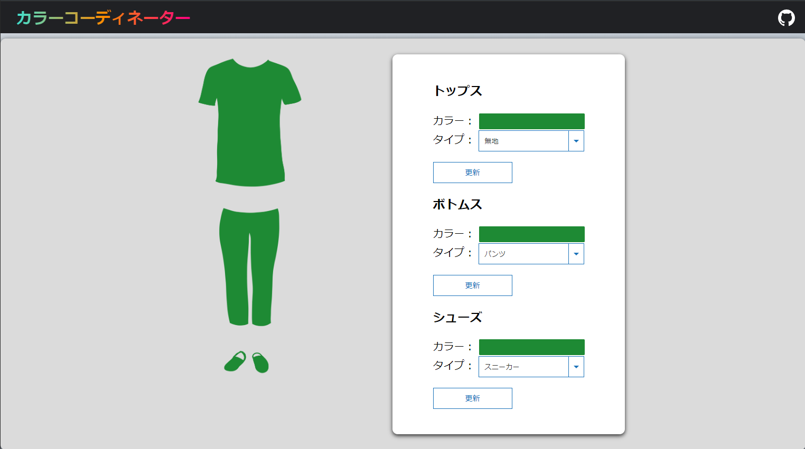

# カラーコーディネーター説明資料

### 概要
「この色の服、どんな服と合わせたらいいんだろう？」そんな問題を解決するアプリケーションです。

- 「真っ赤な服、合わせずらいな。」
- 「緑いろのパンツ、何色と合わせよう。」
- 「黄色っぽい服が欲しいけど、何色が合うんだろう。」

そんな時に利用してもらいたいです。

## 基本画面

### イメージパネル
左半分は、生成したイメージを表示します。
コントロールパネルを操作した場合、反映されます。

### コントロールパネル
右半分は、生成するイメージを変更します。

- トップス
- ボトムス
- シューズ
の3つのパーツを操作できます。

それぞれに
- カラー要素・・・色
- タイプ要素・・・形、柄  

の要素があります。
選んだ後に、更新ボタンを押すことで、イメージが反映されます。

**気に入る色があったら、新しい服を探してみるのもいいかもしれません。**